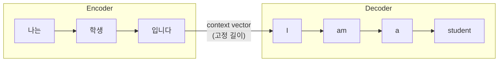

---
tags:
  - ai
  - nlp
  - transformer
  - bert
  - gpt
  - attention
title: 자연어 처리의 발전과 Self-Attention
date: 2026-09-10
summary: TF-IDF와 RNN, 임베딩의 발전을 거쳐 seq2seq와 Self-Attention, 그리고 BERT·GPT로 이어지는 자연어 처리 기술의 흐름을 정리한 문서.
slug: what-is-nlp
category: ai
completed: false
---

자연어 처리는 많은 발전 과정을 거쳤지만 모든 과정을 제대로 파악하기에는 많은 노력이 필요하기에 가장 최근에 발전이 되었고 많은 분야에서 활용되고 있는 **BERT, GPT**에 집중하여 다루고자 합니다.
### 1. 통계 기반 방법: TF-IDF
NLP 기술 발전 초기에는 단어의 빈도를 바탕으로 특정 문서 내에서 어떤 단어가 얼마나 중요한지를찾아내는 방법인 **TF-IDF**를 활용했습니다.

$$TF(t,d) = \frac{문서d에서 단어 t가 등장한 횟수}{문서d에 등장한 모든 단어의 수 }$$
$$IDF(t) = \log\frac{N}{df(t)}$$
NLP 기술 발전 초기에는 단어의 빈도의 계산과 단어의 빈도, 문서의 빈도를 바탕으로 특정 문서 내에 어떠한 단어가 얼마나 중요한지를 찾아내는 방법 TF-IDF 를 활용하였습니다.

핵심 아이디어는 **"이 문서에서는 자주 나오지만 다른 문서에서는 잘 안 나오는 단어"** 가 그 문서를 대표한다는 것입니다. TF만 보면 "은/는/이/가" 같은 조사가 최고점을 받지만, IDF가 모든 문서에 흔한 단어의 가중치를 낮춰줍니다.

한계는 명확합니다. 단어를 **빈도 숫자**로만 다루기 때문에 단어 사이의 의미 관계 ("강아지"와 "개"가 비슷하다는 것)를 전혀 표현하지 못하고, 어순도 무시합니다.

BERT, GPT 이전의 최첨단 기술은 RNN 모델이었습니다. 

RNN은 과거 입력을 기업함으로써 다음 단어를 예측하는데 사용되는 신경망의 일종입니다. 학습시 기울기 소실로 인해서 긴 시퀀스에서 먼 과거의 정보를 기억하지 못하는 문제가 발생했습니다. 

이 문제가 발생한 원인은 RNN이 과거 정보를 시간축을 따라 전달하면서, 역전파 시 같은 연산이 반복되고 그 과정에서 작은 미분값들이 계속 곱해지기 때문입니다.

```
x1 → h1 → h2 → h3 → ... → ht
      과거 정보가 계속 전달됨
t=100 → 99 → 98 → ... → 2 → 1
```

위와 같이 연산 시 **같은 가중치 행렬 $W_{hh}$가 시점 수만큼 반복해서 곱해진다.** 이 행렬의 가장 큰 고윳값이 1보다 작으면 기울기가 0으로 수렴하고(소실), 1보다 크면 발산합니다(폭발).

이 후 **활성화 함수의 미분값**이 이를 악화시킵니다. `tanh`는 미분값이 최대 1, `sigmoid`는 최대 0.25이고 입력이 조금만 커져도 미분값이 0에 가까워집니다. 이 작은 값들이 계속 곱해지면서 기울기가 더 빠르게 작아집니다.

> 기울기 소실
> 신경망이 깊어질수록 역전파 과정에서 기울기가 0에 가까워져 앞쪽 층의 가중치 학습이 잘 이루어지지 않는 현상

>역전파, Backpropagtion
>모델의 예측 결과와 실제 정답의 차이를 이용해서, 각 가중치가 오차에 얼마나 영향을 줬는지 뒤에서부터 계산하는 방법

이를 개선하기 위해 LSTM 이 발전했지만 LSTM의 의존성 문제 예를 들어 "**프랑스**에서 태어난 친구는 독일에 있고, 지금은 한국에 살면서 **모국어**를 가르치고 있다." 라는 문서에서 모국어와 프랑스를 연결하지 못하는 문제가 발생했습니다.
- **모국어**를 가르치고 있다."에서 "모국어"와 "프랑스"의 연결처럼, 거리가 멀어질수록성능이 급격히 떨어집니다.
- **순차 연산**: $h_t$를 계산하려면 $h_{t-1}$이 필요합니다. 시퀀스를 한 단어씩 처리해야 하므로 GPU로 병렬화할 수 없고, 문장이 길수록 느립니다.
## 단어를 벡터로 변환, 임베딩의 발전
TF-IDF의 "단어 = 빈도 숫자"에서 벗어나, 단어를 **의미를 담은 벡터**로 바꾸려는 시도가 이어졌습니다.

이를 수행하는 방식 중 가장 단순한 방식은 **One-Hot Encoding** 방식입니다.

| 단어  | 0   | 1   | 2   |
| --- | --- | --- | --- |
| 고양이 | 1   | 0   | 0   |
| 강아지 | 0   | 1   | 0   |
| 자동자 | 0   | 0   | 1   |
가장 단순한 방법은 어휘 크기만큼의 차원을 만들고 해당 단어 자리만 1로 표시하는 것입니다. 하지만 이 방식은 모든 단어가 서로 직교하기 때문에 "고양이"와 "강아지"의 거리가 "고양이"와 "자동차"의 거리와 똑같습니다. 유사도를 전혀 표현하지 못하고, 어휘가 5만 개면 5만 차원짜리 희소 벡터가 됩니다.

> 희소 벡터
> 벡터의 대부분의 값들이 0으로 채워져있고 일부 값들이 1로 채워져 있는 벡터를 의미

이외에도 다른 방법들은 분포 가설, 비슷한 맥락에 등장하는 단어는 비슷한 의미를 가진다는 가설을 바탕으로 단어를 수백 차원의 조밀한 실수 벡터를 학습하는 방법을 사용했고 이 방법들은 다음과 같습니다.

- **Word2Vec (2013)**: 주변 단어로 중심 단어를 맞히거나(CBOW), 중심 단어로 주변 단어를 맞히도록(Skip-gram) 학습합니다. 학습이 끝나면 `king - man + woman ≈ queen` 같은 벡터 연산이 성립할 만큼 의미 구조가 벡터 공간에 담깁니다.
- **GloVe (2014)**: 전체 말뭉치의 단어 동시 등장 통계를 직접 활용해 벡터를 학습합니다.

## 4. seq2seq와 어텐션의 첫 등장
번역처럼 "입력 문장 → 출력 문장" 형태의 작업을 위해 **Encoder-Decoder(seq2seq)** 구조가 나왔습니다.


인코더 RNN이 입력 문장을 읽어 **하나의 고정 길이 벡터(context vector)** 로 압축하고, 디코더 RNN이 그 벡터만 보고 출력을 한 단어씩 생성합니다.

문장 안의 모든 단어를 서로 비교해 어떤 단어에 얼마나 집중할지에 대해서 계산을 수행합니다. 이때 집중도에 대한 영향을 주는 요소는 QKV 입니다.
QKV
- Query(질의) : 지금 해석하려는 단어
- Key(키) : 비교 대상이 되는 단어들
- Value(값) : 가져올 단어의 실제 정보
$$Q=XW_Q​,K=XW_K​,V=XWV​$$
자연어 처리에 있어서 모델 튜닝은 보통 QKV 값 자체를 직접 설정하는 것이 아니라, QKV를 생성하는 가중치 행렬 $W_Q$,$W_K$,$W_V$,를 학습시키는 것입니다. QKV 를 활용하여 Self Attention 을 수행합니다.

Self Attention은 NLP 작업에 필수적인 강력한 인공 지능 아키텍처인 트랜스포머 모델의 중요한 부분입니다. 트랜스포머 아키텍처는 대다수 최신 LLM의 기반입니다.

.png)

위의 Self Attention 은 
1. Query 를 기반으로 Query Q = $XW_Q$ 의 가중치를 계산
2. Key, $K=XW_k$ 의 계산
3. Q와 K 를 유사도 계산 $Q*K^t$ 계산을 수행한 결과를 전달
   쿼리, 키 및 값 벡터를 얻기 위해 행렬 곱셈이 수행됩니다. 어텐션 메커니즘은 각 쿼리, 키 및 값 구성 요소의 가중치 행렬과 포함된 입력을 기반으로 가중치가 적용된 값 합계를 계산합니다. 이 프로세스를 선형 변환이라고 합니다.
4. 임베딩 변환된 이후 시퀀스의 각 요소에 대한 Attention Score 계산 
   어텐션 가중치는 특정 토큰이 시퀀스의 다른 토큰에 얼마나 많은 집중(또는 어텐션)을 주어야 하는지를 나타냅니다.
5. Softmax 같은 Attention Score 산출
6. 각 단어의 중요도를 계산하여 Value 의 가중합을 계산
7. 계산된 가중합을 기반으로 It 이라는 단어가 어떠한 의미를 가지는지를 계산

위와 같이 각 단어에 대한 처리 방식을 과거의 방식이었던 Encoder Decoder 의 작업 처리 과정을 seq2seq 처리를 하는 단계에서 발생했던 작업 처리 지연을 병렬화를 통해서 입력 시퀀스의 모든 부분에 걸쳐 가중치를 동시에 계산하여 시간을 줄이고 아웃풋 생성을 향상하는 기능이 가능해졌습니다.

앞서 설명한 Transformer 의 핵심 기능인 Self Attention 기능을 활용하여 오늘날에는 대표적인 트랜스포머 BERT, GPT 계열의 모델이 NLP 분야에서 활발하게 개발과 사용이 되고 있습니다.

| 계열      | 기본 구조                    | 강점              | 대표 작업                      |
| ------- | ------------------------ | --------------- | -------------------------- |
| BERT 계열 | Transformer Encoder-only | 문맥 이해 분석        | 분류, 감성분석, 개체명 인식, 유사도, 임베딩 |
| GPT 계열  | Transformer Decoder-only | 다음 토큰 예측 테스트 생성 | 문장 생성, 요약, 번역, 질의응답, 코드 생성 |
